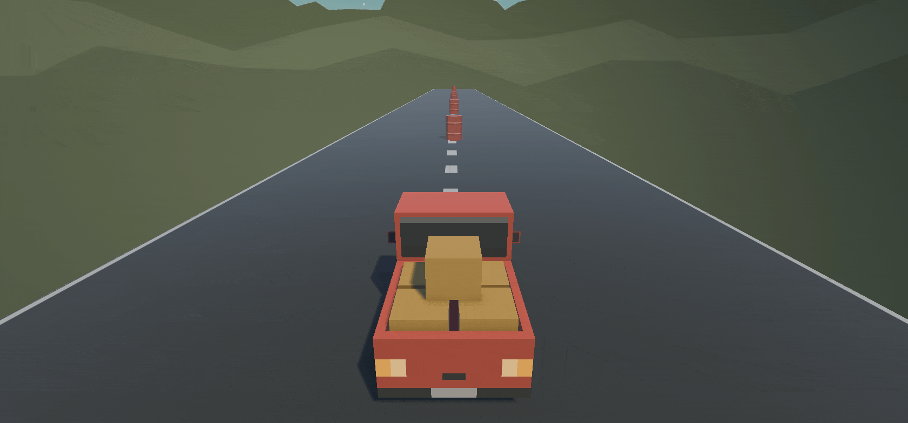

# Prototype 1 for the Unity Junior Programmer Pathway

## Overview

Small prototype application introducing to tools and concepts of Unity by creating a simple 3D game where player is controlling a vehicle and avoiding obstacles.

## Basics (1.1)

- Creating a new project
- Importing Downloaded Assets
- Adding objects to the scene
- Moving objects in the scene
- Unity UI
- Unity Application layout
- Navigation in the scene view
- GameObject manipulation tools

## Rigidbody and scripting (1.2)

- Rigidbody component 
- Scripting in Unity
  - Moving object at a constant speed (using deltaTime)

## Camera (1.3)

- Scripting camera movement
  - Smooth follow
- Variables
  - Access modifiers
  - Variables accessible in the inspector  

## User Input (1.4)

- User input in Unity
- Scripting player movement
  - Using Input.GetAxis
- Parenting objects
- Scripting player rotation

## Challenge

- from a given scene of a plane with obstacles, create a script that will move the plane forward and make it go up and down when the player presses up and down arrow keys.
- make the camera follow the plane smoothly
- make the propeller rotate

